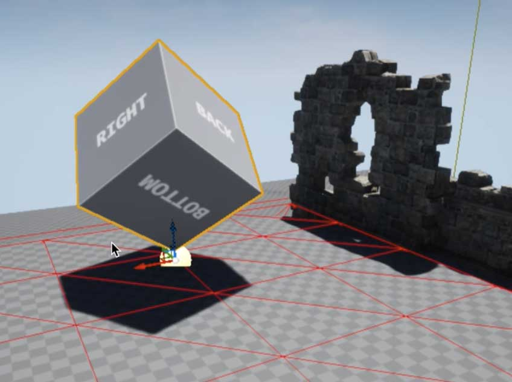

# Artifact Brief

## Résumé : 

Mettre en scène la découverte d'un artéfact dans un environnement ouvert. Dans un 
premier temps l'artéfact est invisible, caché par des éléments du décor (végétation,
relief, ruines). Une rampe, immédiatement visible, mène à un petit plateau où l'on
découvre l'artefact. Celui-ci a un aspect surnaturel.

## Description détaillée

- Template Unreal : [ThirdPerson](https://docs.unrealengine.com/4.26/en-US/Resources/Templates/ThirdPerson/)
- Assets: [InfinityGrassLand](https://www.unrealengine.com/marketplace/en-US/product/infinity-blade-plain-lands)

### Le terrain (Landscape)

Ressources :
- [TheArtifact-Landscape-Volume.fbx](assets/TheArtifact-Landscape-Volume.fbx)

A partir du template Unreal "ThirdPerson", dans une nouvelle scène (level) 
modéliser un terrain (outil "Landscape") dont l'élevation doit suivre le volume 
donné par le fichier [TheArtifact-Landscape-Volume.fbx](assets/TheArtifact-Landscape-Volume.fbx).

 

Pour le volume, afin de "voir à travers" il faut mettre en place un matériau filaire
dont voici le blueprint :  

 

Pour permettre une modélisation fine, le terrain est "petit" mais dense (maille 20cm).
Voici les réglages : 

 

### L'artéfact

Ressources :
- [TheArtifact-Object-High.fbx](assets/TheArtifact-Object-High.fbx)
- [TheArtifact-Object-Texture.psd (zip)](assets/TheArtifact-Object-Texture.psd.zip)

L'artéfact est composé de primitives simples (cube, tore) dont les UV sont faciles 
à travailler.

Créer le blueprint de base de l'artefact (video youtube) :  

### Grille d'évaluation

|  | Technique | Artistique | Bonus / Malus divers |
|---|---|---|---|
| note | /10 | /10 |  |
| commentaire | Evaluation principalement sous la forme de bonus / malus :  Les éléments sont-ils correctement placés ? Se trouvent-ils des bugs "graphiques" (trous dans le décor, éléments flottants) ? Les screenshots sont-ils corrects (pas de warnings "LIGHTING NEEDS TO BE REBUILT", pas de morceaux d'UI). | Est-ce joli ?  A-t-on envie d'explorer l'univers ?  L'artefact est-il surprenant ?  A-t-on envie d'en savoir plus ? | Retard. Contraintes non respectées. |

#### Contraintes techniques de rendu : 
- Moins de 1Mo par image (pas de PNG mais des jpeg avec une compression autour de 50%)
- Pas de bord, pas de bouts d'UI.
- Pas de message "LIGHTING NEEDS TO BE REBUILT"
