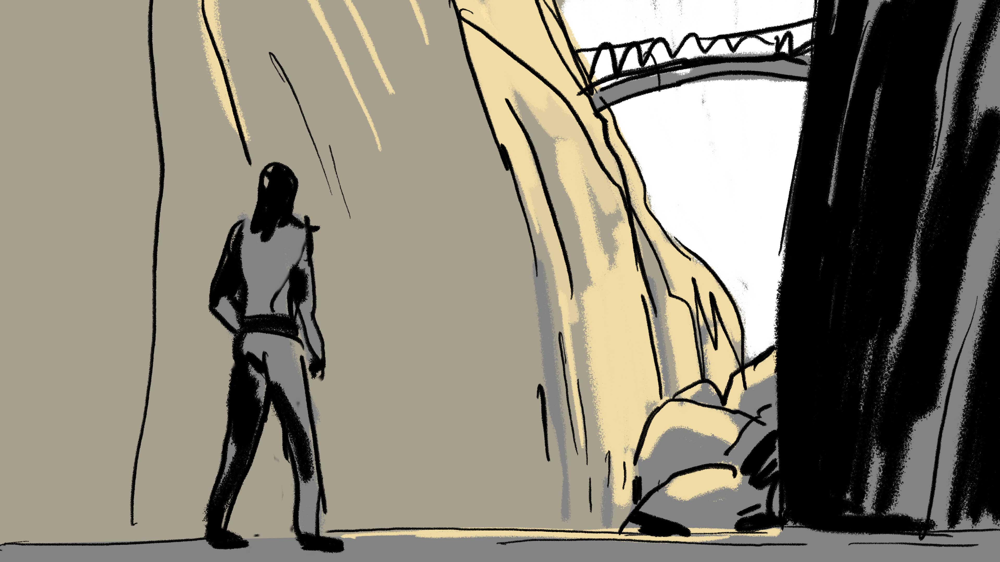

# The Rift

## Résumé

Mettre en scène l'ascension du joueur depuis le fond d'un rift vers les bords du plateau. 

## Description détaillée

Au commencement, le joueur sort d'une espace clos (grotte, tunnel, couloir) pour 
arriver au fond d'une vallée très encaissée (rift). Dans l'envirronement immédiat
une chemin se propose pour escalader les parois. Le chemin est étroit, la 
progression difficile, les chutes possibles obligent à recommencer l'ascension.
La scène se termine sur une traversée du rift par un pont (une structure naturelle ou artificielle). 
La traversée permet d'observer le point de départ en contrebas. 
La traversée déclenche un évènement sonore ET graphique (à définir).

## Contraintes :
- Au tout début le joueur se trouve encore dans un espace clos.
- L'ascension doit pouvoir se faire avec le "blueprint" ThirdPerson (hauteur 
  de saut ajustable dans les limites du raisonnable).
- La traversée du rift doit offrir un point de vue sur le point de départ en 
  contrebas.
- La traversée du rift déclenche un évènement sonore ET graphique (bruit, musique, 
  effet d'ambiance + effet visuel, pluie, particules, jeu sur la lumière...).
- Le décor doit se faire avec l'outil terrain et un matériaux "Landscape" avec 
  au moins 2 "layers" (ex: 1 pour la roche, 1 pour le sol plat).

## Assets :
3 catégories d'assets sont possibles : 
- Les assets _"téléchargés"_ issus des packs gratuits pré-selectionnés.
- Les assets _"créés"_ à partir d'un logiciel de 3D. S'il y en a, pensez à le 
  préciser quelque part pour rendre compte du travail réalisé.
- Les assets _"téléchargés-hors-pack-pré-selectionnés-parce-que-j-y-tiens-vraiment"_,
  (provenant des packs Unreal ou de n'importe quelle banque 3D en ligne) ok c'est
  possible mais une raisonnable mesure et à condition de bien le préciser dans la 
  présentation HTML (dans une balise paragraphe dédiée (`
`)).
  

Les assets téléchargés doivent faire partie de la sélection suivante :
- [Infinity Blade: Grass Lands](https://www.unrealengine.com/marketplace/en-US/product/infinity-blade-plain-lands)
- [Infinity Blade: Castle](https://www.unrealengine.com/marketplace/en-US/product/infinity-blade-castle)
- [Infinity Blade: Hideout](https://www.unrealengine.com/marketplace/en-US/product/infinity-blade-hideout)
- [Procedural Nature Pack Vol.1](https://www.unrealengine.com/marketplace/en-US/product/procedural-nature-pack-vol)

## Technique : 
 - [Options pour le terrain  ](assets/TheRift-LandscapeSettings.png)

## Premier rendu :
- [ ] Une capture d'écran "in-game" depuis le point de départ où "l'espace clos" 
  occupe environ un tiers de l'écran.
- [ ] Une capture d'écran "in-game" de l'ascension (n'importe quel point de vue 
  qui vous semble intéressant).
- [ ] Une capture d'écran "editor" du parcours (vue aérienne, en plongée) avec 
  éventuellement des éléments masqués pour l'occasion. Cette vue sert à montrer 
  la mise en place générale du parcours.